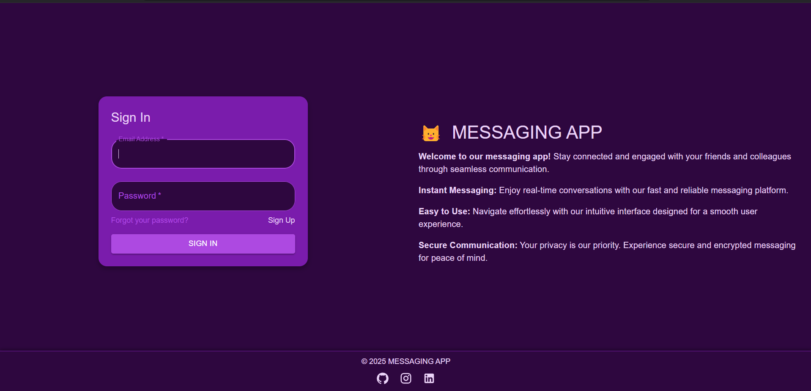

# Messaging App

## Overview
This project is a **Messaging App** built with **React.js**, **Vite**, **Material UI**, and **Tailwind CSS**. The application provides a comprehensive messaging platform featuring user authentication, real-time chat capabilities, and an AI assistant powered by Gemini. Users can engage in one-on-one chats, group conversations, and manage their contacts effectively.

## Screenshots


## Features
- **User Authentication**: Login and signup functionality for secure access.
- **Dashboard**: Displays online users and unread messages for quick access.
- **Chat Functionality**: Real-time messaging with options to make voice calls and send files.
- **Contacts Management**: View and manage all contacts easily.
- **Call Logs**: Keep track of call history and logs.
- **Group Chat**: Engage in group conversations with multiple users.
- **Settings Page**: Customize user settings and preferences.
- **AI Assistant**: Chat with the Gemini AI assistant for quick help and information.

## Technologies Used
- **React.js**: For building the user interface.
- **Vite**: For fast development and build processes.
- **Material UI**: For pre-designed UI components.
- **Tailwind CSS**: For custom styling and responsive design.
- **Socket.IO**: For real-time communication.
- **Gemini AI**: For integrating AI functionalities.

## How to Run

### Prerequisites
- Ensure you have **Node.js** and **npm** installed on your machine.

### Steps to Run:
1. **Clone the Repository**:
    ```bash
    git clone https://github.com/yourusername/messaging-app.git
    cd messaging-app
    ```

2. **Install Dependencies**:
    ```bash
    npm install
    ```

3. **Start the Development Server**:
    ```bash
    npm run dev
    ```

4. **Open in Browser**:
   - Open your browser and go to `http://localhost:3000` (or the specified port) to view the application.

## Usage
- **Login/Signup**: Users can create an account or log in to access the messaging features.
- **Dashboard**: View online users and unread messages at a glance.
- **Chat Page**: Engage in real-time chat, make calls, and send files.
- **Contacts and Groups**: Manage contacts and participate in group chats.

## Future Enhancements
- Add end-to-end encryption for enhanced security.
- Implement video calling capabilities.
- Improve the AI assistant functionality for better user interaction.


## Author
**Hassan Jamshaid**  
*Contact: hjamshaid81@gmail.com*<br> 
For any queries or contributions
